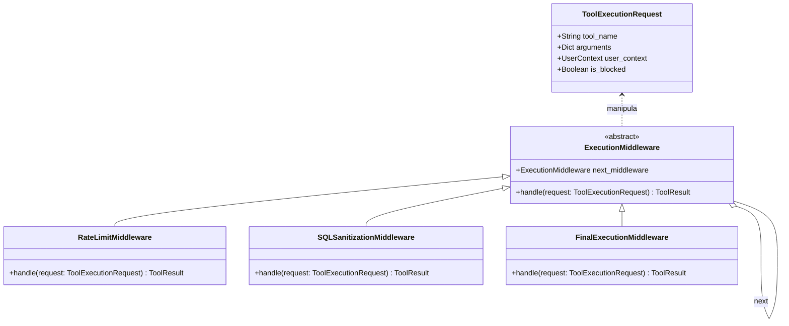

# Refatoração Conceitual: Chain of Responsibility (Escudo de Execução)

> **Declaração de Transparência (Uso de IA):** A auditoria, a identificação do problema arquitetural e a concepção da solução utilizando o padrão *Chain of Responsibility* foram realizadas integralmente de forma autoral pela equipe técnica. Contudo, para a geração do código em sintaxe declarativa UML (Mermaid) utilizado na renderização gráfica dos diagramas abaixo, fez-se o uso de ferramentas de Inteligência Artificial Generativa com o intuito de otimizar a formatação visual do artefato.

A vulnerabilidade arquitetural identificada no `Vanna 2.0` reside na execução direta de ferramentas a partir da inferência do modelo de linguagem (`tool_registry.execute()`). Para mitigar esse risco e proteger o banco de dados contra instruções SQL destrutivas geradas por eventuais alucinações, propõe-se a implementação do padrão **Chain of Responsibility**.

## 1. Diagrama de Classes (Estrutura)
O diagrama a seguir ilustra a hierarquia de `Middlewares` de execução. A requisição de ferramenta (`ToolExecutionRequest`) deve passar intacta por todos os elos da corrente antes de atingir a execução física no banco.

## 2. Diagrama de Sequência (Fluxo de Proteção)
O fluxo abaixo demonstra a aplicação bloqueando um comando SQL destrutivo (`DROP TABLE`).

sequenceDiagram
    actor LLM
    participant Agent
    participant Pipeline as ExecutionPipeline
    participant RateLimit as RateLimitMiddleware
    participant SQLCheck as SQLSanitizationMiddleware
    participant Exec as FinalExecutionMiddleware
    participant DB as Banco de Dados

    LLM->>Agent: Solicita execucao de comando SQL
    Agent->>Pipeline: handle(ToolExecutionRequest)
    
    Pipeline->>RateLimit: handle(request)
    alt Cota excedida
        RateLimit-->>Agent: Bloqueio (Erro de Cota)
    else Cota disponível
        RateLimit->>SQLCheck: handle(request)
        
        alt Comando destrutivo detectado
            SQLCheck-->>Agent: Bloqueio de Segurança
            Agent-->>LLM: Falha na Execução
        else Comando SELECT seguro
            SQLCheck->>Exec: handle(request)
            Exec->>DB: await sql_runner.run_sql()
            DB-->>Exec: Retorna DataFrame
            Exec-->>Agent: ToolResult(Sucesso)
            Agent-->>LLM: Contexto Injetado
        end
    end
